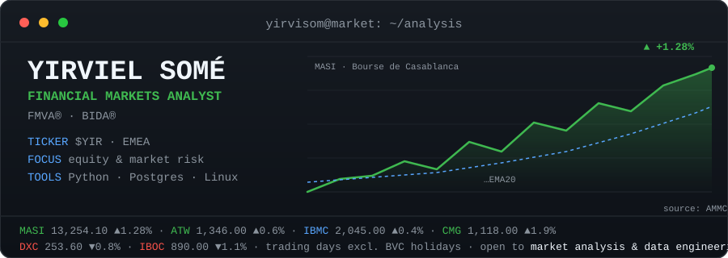

## Hi, I'm Yirviel Somé 👋

**Financial Markets Analyst** · FMVA® · BIDA® · based in Casablanca · `TZ=Africa/Casablanca`

I turn market data into decisions. My work sits at the intersection of
**equity & market-risk analysis** and the engineering that feeds it —
quant research on listed markets, regulatory-disclosure monitoring, and
due-diligence data pipelines. Everything here is code with a thesis behind it.

## What I work on

| Repo | What it is |
| --- | --- |
| [casablanca-quant-framework](https://github.com/yirvisom/casablanca-quant-framework) | Quant research on Bourse de Casablanca data — Monte Carlo simulation, VaR 95%, and portfolio optimization in a reproducible, LUKS-secured workflow. |
| [bvc-tracker](https://github.com/yirvisom/bvc-tracker) | Regulatory disclosure monitor for the Moroccan market — scrapes AMMC issuer publications, LLM-extracts disclosure signals, pushes Telegram alerts. |
| [M-A-Clean-Room](https://github.com/yirvisom/M-A-Clean-Room) | Self-hosted data clean room for buy-side M&A diligence — tokenized target financials: income statements, working capital, concentration, EBITDA. |

> Deep dives and write-ups: [deyirviel.com](https://deyirviel.com)

## Market & risk toolkit

## The systems that run it

The analysis is only as good as the pipeline under it — that's why I also
spend time on Linux. RHEL-based tooling, self-hosting, and hardening
(**RHCSA in progress**).

## Elsewhere

- Portfolio & case studies: [deyirviel.com](https://deyirviel.com)
- LinkedIn: [in/yirviel-somé](https://linkedin.com/in/yirviel-somé)
- Email: [yirviell.some@gmail.com](mailto:yirviell.some@gmail.com)