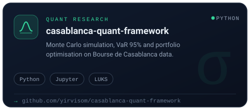
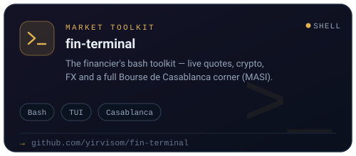
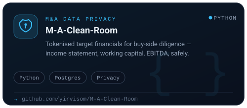
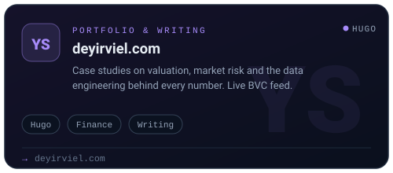
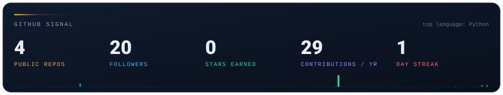
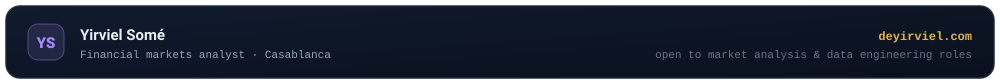

  

  <a href="https://deyirviel.com"><b>Portfolio</b></a> &nbsp;·&nbsp;
  <a href="https://deyirviel.com/bvc-feed/"><b>BVC Feed</b></a> &nbsp;·&nbsp;
  <a href="https://www.linkedin.com/in/yirviel-somé">LinkedIn</a> &nbsp;·&nbsp;
  <a href="mailto:yirviell.some@gmail.com">Email</a>

  
  &nbsp;
  

### `~/ $ whoami`

A **portfolio manager in the making**, based in Casablanca. I'm training the way
I'd verify a model: allocation first, risk second, return last — and everything
checked against the market.

That means building the full chain a PM relies on: **portfolio construction and
optimization** on the Bourse de Casablanca, **factor and market-risk research**,
**valuation** grounded in fundamentals, and a **macro/markets context** around all
of it — with the data and Linux infrastructure underneath to keep it reproducible.

Most of my public work is code with a thesis behind it: a model, a number, a way
to check it. **FMVA® · BIDA® · RHCSA in progress.**

> **Currently** — a disciplined study of portfolio theory (Markowitz → Grinold &
> Kahn → Ang), live factor research on Moroccan listed equities, and a daily
> practice of the reading list that keeps the judgment sharp.

## The craft

<table>
  <tr>
    <td width="50%" valign="top">
      <b>01 · Allocation & construction</b> 
      Mean-variance to factor models — weights as a deliberate bet, not a whim.
      Markowitz to Ang: the discipline of the efficient frontier.
    </td>
    <td width="50%" valign="top">
      <b>02 · Risk, then return</b> 
      VaR, stress, exposure. The question a PM asks first is what breaks the
      book — the return decides itself afterwards.
    </td>
  </tr>
  <tr>
    <td width="50%" valign="top">
      <b>03 · Equity & absolute value</b> 
      DCF, LBO, comps — a number that can't be defended to a committee isn't
      a number. Valuation is the last line of defense against the story.
    </td>
    <td width="50%" valign="top">
      <b>04 · Markets & macro cycles</b> 
      Credit cycles, factor rotations, behavioral biases. The edge of a PM is
      mostly context — recognizing when the market disagrees with you.
    </td>
  </tr>
</table>

## Selected work

<table>
  <tr>
    <td width="50%">
      
    </td>
    <td width="50%">
      
    </td>
  </tr>
  <tr>
    <td width="50%">
      
    </td>
    <td width="50%">
      
    </td>
  </tr>
</table>

## By the numbers

  

## The reading room

The shelf a PM-in-training works through — theory, risk, and the judgment that
keeps a gérant honest.

- **Theory & asset pricing** — Markowitz, Grinold & Kahn, Ang (factor investing), Elton & Gruber, Ilmanen, Cochrane
- **Quant & systematic** — López de Prado, Qian/Hua/Sorensen, Narang, Carver
- **Risk** — Hull, Jorion, Crouhy/Galai/Mark
- **Valuation & corporate** — Brealey/Myers/Allen, McKinsey, Penman, Rosenbaum & Pearl
- **Behavior & mentality** — Kahneman, Thaler, Howard Marks, Taleb, Schwager
- **History & markets** — Chancellor, Lowenstein (LTCM), Lewis, Soros, Reinhart & Rogoff

> **Reading now** — *Asset Management* (Ang) for factor investing, alongside
> *Expected Returns* (Ilmanen)'s risk-premium maps.

## Toolkit

**Quant & markets**

**Engineering & systems**

**Web & publishing**

## How I work

<table>
  <tr>
    <td width="50%" valign="top">
      <b>Risk first, return second</b> 
      Every position starts with what hurts me. If the drawdown story holds,
      the upside takes care of itself.
    </td>
    <td width="50%" valign="top">
      <b>Thesis over prediction</b> 
      I don't bet on being right — I bet on being able to explain, test, and
      size a view. Faith in process, not forecasts.
    </td>
  </tr>
  <tr>
    <td width="50%" valign="top">
      <b>Reproducible research</b> 
      Pipelines over one-off spreadsheets — versioned, schedulable, and honest
      about their confidence. No black boxes in finance.
    </td>
    <td width="50%" valign="top">
      <b>Discipline & the written record</b> 
      Discipline is built one reviewed decision at a time — the write-up is
      part of the deliverable, and the next decision gets better because of it.
    </td>
  </tr>
</table>

## Elsewhere

- **Portfolio & case studies** — [deyirviel.com](https://deyirviel.com)
- **LinkedIn** — [in/yirviel-somé](https://www.linkedin.com/in/yirviel-somé)
- **Email** — [yirviell.some@gmail.com](mailto:yirviell.some@gmail.com)

 

